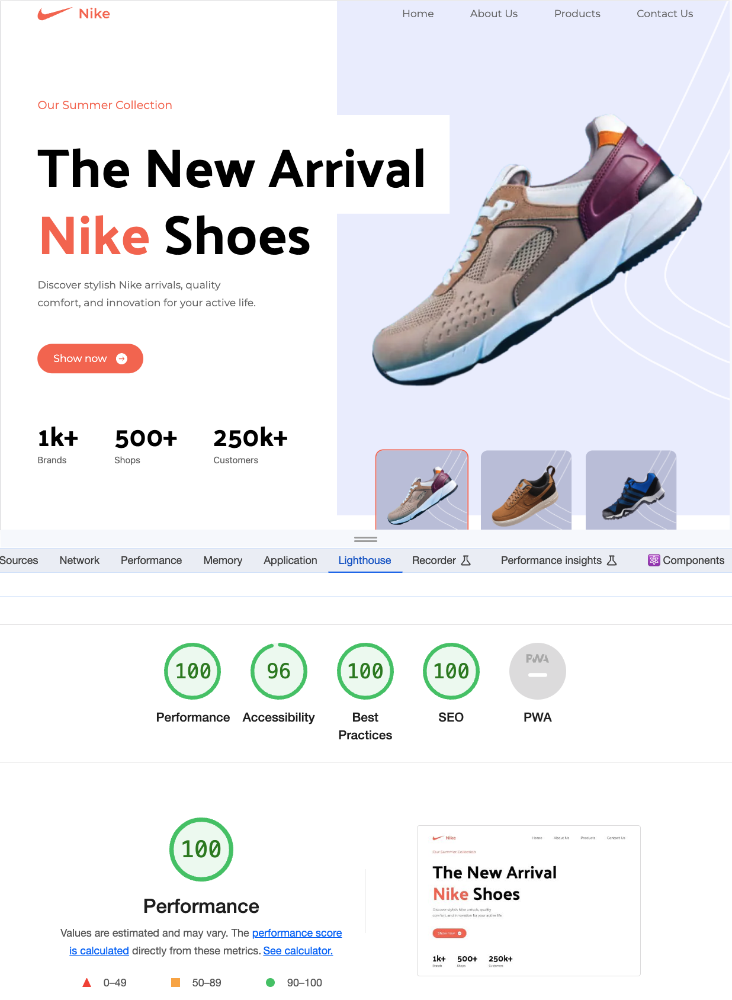

<h1 align='center' >Nike Landing Page</h1>

 

[Deploy by Vercel]()

<h2>Небольшой проект для практики с применением UI Фреймворка - TailwindCSS</h2> 

<h3>Реализовано:</h3>

+ 100% Mobile Responsive
+ Functional Components
+ SSR

___

<h3>Планы по доработке:</h3>

+ Добавить анимацию с помощью Framer Motion
+ Добавить интерактивность
+ Масштабировать проект и реализовать роутинг страниц
